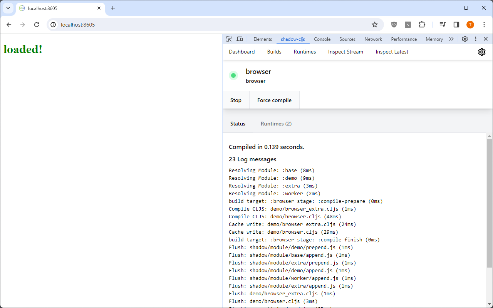
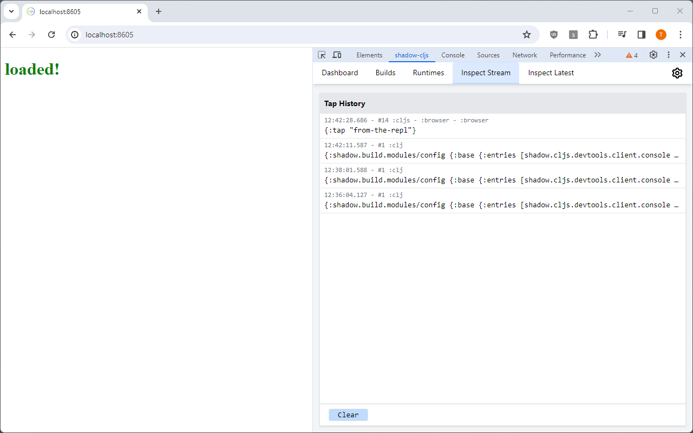

# shadow-cljs UI Browser Extension

Very bare bones extension, which just opens the shadow-cljs UI as a devtools panel.

To use clone this repo and load the `extension` folder via "Load unpacked" in [chrome://extensions/](chrome://extensions/).

